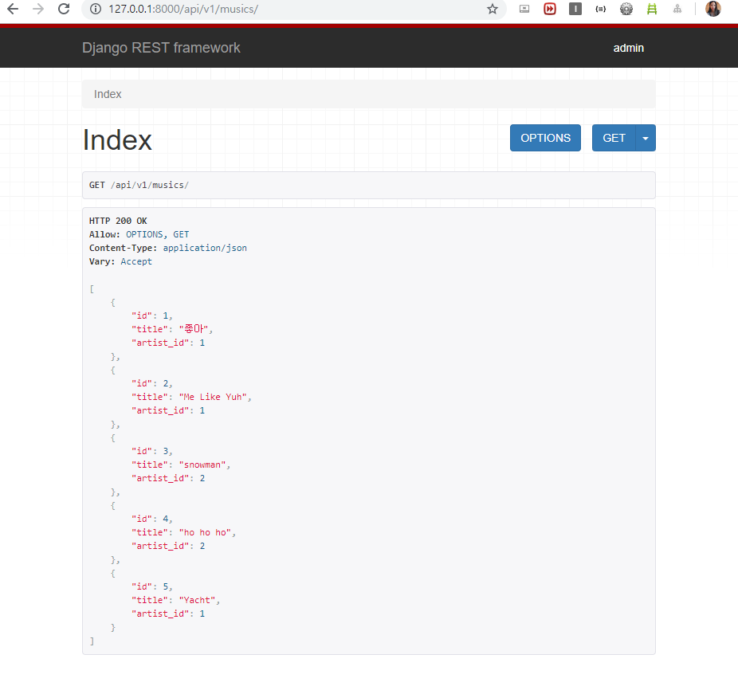

# Django rest framework

> API 서버로서의 django 활용
>
> 지금은 django 서버가 응답이 들어오면 html 만들어 전달하는 폭넓은 역할 수행하였다.
>
> 오늘은 API서버로서의 django로 (데이터를 주는 API서버) 요청이 들어오면 처리를 하는데 json을 던져주고, vue나 react가 처리할 것이다.

* REST API
  * 행위 - method
  * 자원 - URL
  * 표현 - JSON
* API (Application Programming Interface) : 프로그래밍으로 인터페이스
  * tv의 인터페이스는 리모컨
  * Interface : 
    * GUI(Graphic User Interface): 그래픽으로 유저랑 상호작용하는 인터페이스
    * CLI(Command Line Interface): 명령어로 유저랑 상호작용하는 인터페이스

* rest framework 설치

  ```shell
  $ pip install djangorestframework
  $ pip freeze > requirements.txt
  ```

  * python 3.8은 django에서 실행 안되는 모듈이 있어서 python 3.7사용

* `settings.py ` 의  ` INSTALLED_APP`에 `rest_framework`추가

* musics 앱 만들고 앱 추가

## 모델링

* `musics/models.py`

  ```python
  from django.db import models
  
  # Create your models here.
  class Artist(models.Model):
      name = models.TextField()
  
      def __str__(self):
          return self.name
  
  class Music(models.Model):
      artist = models.ForeignKey(Artist, on_delete=models.CASCADE)
      title = models.TextField()
  
      def __str__(self):
          return self.title
  
  class Review(models.Model):
      music = models.ForeignKey(Music, on_delete=models.CASCADE)
      content = models.TextField()
  ```

## serializer


* 편의 위해 superuser 생성 후 admin 사이트에 모델 등록

  * `musics/admin.py`

    ```python
    from django.contrib import admin
    
    from .models import Artist, Music, Review
    # Register your models here.
    admin.site.register(Artist)
    admin.site.register(Music)
    admin.site.register(Review)
    ```

* admin사이트에서 예제 데이터 넣기

* json타입 덤프데이터 만들기

  ```shell
  # dumpdata -> data를 복사한다.
  $ python manage.py dumpdata musics
  [{"model": "musics.artist", "pk": 1, "fields": {"name": "\ubc15\uc7ac\ubc94"}},
  {"model": "musics.artist", "pk": 2, "fields": {"name": "sia"}}, {"model": "musics.music", "pk": 1, "fields": {"artist": 1, "title": "\uc88b\uc544"}}, {"model":
  "musics.music", "pk": 2, "fields": {"artist": 1, "title": "Me Like Yuh"}}, {"model": "musics.music", "pk": 3, "fields": {"artist": 2, "title": "snowman"}}, {"model": "musics.music", "pk": 4, "fields": {"artist": 2, "title": "ho ho ho"}}, {"model": "musics.music", "pk": 5, "fields": {"artist": 1, "title": "Yacht"}}](venv)
  
  # musics/fixtures 폴더 만들기
  # json 타입으로 저장
  $ python manage.py dumpdata --indent 2 musics > ./fixtures/musics.json
  ```

* `urls.py`에 `musics.url` `include`

* `musics/urls.py` index 경로 지정

* `musics/views.py`

  ```python
  from django.shortcuts import render
  from rest_framework.response import Response
  from rest_framework.decorators import api_view
  
  from .models import Music
  from .serializers import MusicSerializers
  # Create your views here.
  
  @api_view(['GET']) # HTTP method
  def index(request):
      musics = Music.objects.all()
      serializer = MusicSerializers(musics, many=True)
      return Response(serializer.data)
  ```

* `musics/serializers.py` 생성

  ```python
  from rest_framework import serializers
  from .models import Music
  
  class MusicSerializers(serializers.ModelSerializer):
      class Meta:
          model = Music
          fields = ('id', 'title', 'artist_id')
  ```

  * 가지고 있는 object를 json형식으로 만들어줌
  * serializers (직렬화)
  * 모델폼 지정할 때와 비슷한 형식

  

## drf-yasg

* [링크](https://github.com/axnsan12/drf-yasg)

* 설치

  ```shell
  $ pip install drf_yasg
  ```

* settings.py 에 `'drf_yasg',`추가

* musics/urls.py

  ```python
  ...
  from drf_yasg.views import get_schema_view
  from drf_yasg import openapi
  
  schema_view = get_schema_view(
     openapi.Info(
        title="Music API",
        default_version='v1',
        description="Music, Artist 정보",
     ),
  )
  
  urlpatterns = [
      ...
      path('redoc/', schema_view.with_ui('redoc'), name='api_docs'),
      path('swagger/', schema_view.with_ui('swagger'), name='api_swagger'),
  ]
  ```

## Restful url pattern

* GET reviews/ 리뷰 목록
* POST reviews/ 리뷰 등록하기
* GET reviews/1/ 1번 리뷰 가져오기
* PUT reviews/1/ 1번 리뷰 수정하기
* DELETE reviews/1/ 1번 리뷰 삭제하기